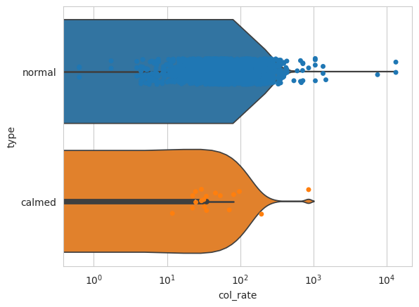

# Connecting Intersection Data with the Roads Surrounding It

An Issue with the previous analysis (Analysis.ipynb) is the the traffic data was tied to intersections  
and not the road themselves. This makes sense for when the data was recorded, as intersections allow for multiple  
roads to be recorded, rather than just one. The issue is that the data is no longer geographcially tied to  
the roads, and hence needs to be re-connected.

The previous analysis assumed that all roads around an intersection shared the same traffic data, and  
this may have contributed to the conlusion of that analysis that roads with calming features were  
no more effective than regular roads at preventing collisions. However what was observed is that  
many roads were influenced by intersections with high traffic counts, traffic counts that may have  
been instead the result of other nearby high traffic roads.

Each intersection however does record the direction that traffic is headed towards in seperate columns:  
nb_cars being "north bound cars" for example.  
What we can do in this case is that for each intersection, find the roads most at these cardinal directions  
and assign to them the value from the associated cardinal direction from the intersection data.

The assumptions that we will make are that each intersection has no more than 4 roads, as those are  
the only four columns of data that we are given. We will also assume that for less than four roads  
the column with the missing cardinal direction will be 0, or NaN. In this way if there is a road  
missing, one of the three remaining roads will account for two cardinal directions, itself and  
the missing one. But if the missing road has no data, then when we add the two directions for  
the one road our overall count is not affected.


```python
#Libraries for Data Manipulation
###########################
import pandas as pd
import geopandas as gpd
import numpy as np
from shapely.geometry import Point, Polygon
#see all dataframe columns when calling head on a dataframe
pd.set_option('display.max_columns', None)

#Libraries for geocoding
###########################
from geopy.geocoders import Nominatim
from geopy.geocoders import GoogleV3

#Libraries for Mapping
###########################
from mpl_toolkits.basemap import Basemap
import matplotlib.pyplot as plt
import folium

#Libraries for Plotting data
###########################
import matplotlib.pyplot as plt
import matplotlib.colors
import seaborn as sns
import matplotlib as mpl
import scipy.stats as pystat
import matplotlib.pyplot as plt
from mpl_toolkits.axes_grid1 import make_axes_locatable
import branca
import branca.colormap as cm
import scipy

#Ignore copy warnings for dataframes
#The warnigns are meant to bring attention that a copy of data
#not the orignal is being manipulated. However manipulating copies
#  is the intended action at times.
import warnings
pd.options.mode.chained_assignment = None  # default='warn'
warnings.simplefilter(action='ignore', category=FutureWarning)

#Tell matplot lib to generate plots inline, within the notebook
%matplotlib inline
```

### Importing Data

We read the road data from our previous analysis that we saved


```python
file = "road_26917.shp"
road_26917 = gpd.read_file(file)
```

We also reread the traffic data and convert is to epsg: 26917


```python
#read shapefiles
file_path_1 = "/workspace/GIS_project/data/traffic/raw-data-2010-2019.csv"
file_path_2 = "/workspace/GIS_project/data/traffic/raw-data-2020-2029.csv"
#combine the csvs into a single dataframe
traffic = pd.concat(
    map(pd.read_csv, [file_path_1, file_path_2]), ignore_index=True)
#create geometry
points = traffic.apply(lambda row: Point(row.lng, row.lat), axis = 1)
#convert to geodataframe
traffic_26917 = gpd.GeoDataFrame(traffic, geometry=points)

#set initial crs and change it to local projection
traffic_26917 = traffic_26917.set_crs(epsg=4326)
traffic_26917 = traffic_26917.to_crs(epsg=26917)
traffic_26917.head()

```


<div>
<style scoped>
    .dataframe tbody tr th:only-of-type {
        vertical-align: middle;
    }

    .dataframe tbody tr th {
        vertical-align: top;
    }

    .dataframe thead th {
        text-align: right;
    }
</style>
<table border="1" class="dataframe">
  <thead>
    <tr style="text-align: right;">
      <th></th>
      <th>_id</th>
      <th>count_id</th>
      <th>count_date</th>
      <th>location_id</th>
      <th>location</th>
      <th>lng</th>
      <th>lat</th>
      <th>centreline_type</th>
      <th>centreline_id</th>
      <th>px</th>
      <th>time_start</th>
      <th>time_end</th>
      <th>sb_cars_r</th>
      <th>sb_cars_t</th>
      <th>sb_cars_l</th>
      <th>nb_cars_r</th>
      <th>nb_cars_t</th>
      <th>nb_cars_l</th>
      <th>wb_cars_r</th>
      <th>wb_cars_t</th>
      <th>wb_cars_l</th>
      <th>eb_cars_r</th>
      <th>eb_cars_t</th>
      <th>eb_cars_l</th>
      <th>sb_truck_r</th>
      <th>sb_truck_t</th>
      <th>sb_truck_l</th>
      <th>nb_truck_r</th>
      <th>nb_truck_t</th>
      <th>nb_truck_l</th>
      <th>wb_truck_r</th>
      <th>wb_truck_t</th>
      <th>wb_truck_l</th>
      <th>eb_truck_r</th>
      <th>eb_truck_t</th>
      <th>eb_truck_l</th>
      <th>sb_bus_r</th>
      <th>sb_bus_t</th>
      <th>sb_bus_l</th>
      <th>nb_bus_r</th>
      <th>nb_bus_t</th>
      <th>nb_bus_l</th>
      <th>wb_bus_r</th>
      <th>wb_bus_t</th>
      <th>wb_bus_l</th>
      <th>eb_bus_r</th>
      <th>eb_bus_t</th>
      <th>eb_bus_l</th>
      <th>nx_peds</th>
      <th>sx_peds</th>
      <th>ex_peds</th>
      <th>wx_peds</th>
      <th>nx_bike</th>
      <th>sx_bike</th>
      <th>ex_bike</th>
      <th>wx_bike</th>
      <th>nx_other</th>
      <th>sx_other</th>
      <th>ex_other</th>
      <th>wx_other</th>
      <th>geometry</th>
    </tr>
  </thead>
  <tbody>
    <tr>
      <th>0</th>
      <td>1</td>
      <td>25081</td>
      <td>2010-01-12</td>
      <td>32187</td>
      <td>LILLIAN ST AT SOUDAN AVE</td>
      <td>-79.393259</td>
      <td>43.705283</td>
      <td>2.0</td>
      <td>13457294.0</td>
      <td>NaN</td>
      <td>2010-01-12T07:30:00</td>
      <td>2010-01-12T07:45:00</td>
      <td>8.0</td>
      <td>0.0</td>
      <td>1.0</td>
      <td>0.0</td>
      <td>0.0</td>
      <td>0.0</td>
      <td>0.0</td>
      <td>51.0</td>
      <td>0.0</td>
      <td>0.0</td>
      <td>31.0</td>
      <td>0.0</td>
      <td>0.0</td>
      <td>0.0</td>
      <td>1.0</td>
      <td>0.0</td>
      <td>0.0</td>
      <td>0.0</td>
      <td>0.0</td>
      <td>1.0</td>
      <td>0.0</td>
      <td>0.0</td>
      <td>0.0</td>
      <td>0.0</td>
      <td>0.0</td>
      <td>0.0</td>
      <td>0.0</td>
      <td>0.0</td>
      <td>0.0</td>
      <td>0.0</td>
      <td>0.0</td>
      <td>1.0</td>
      <td>0.0</td>
      <td>0.0</td>
      <td>0.0</td>
      <td>0.0</td>
      <td>12.0</td>
      <td>0.0</td>
      <td>0.0</td>
      <td>1.0</td>
      <td>0.0</td>
      <td>0.0</td>
      <td>0.0</td>
      <td>0.0</td>
      <td>0.0</td>
      <td>0.0</td>
      <td>0.0</td>
      <td>0.0</td>
      <td>POINT (629455.771 4840394.445)</td>
    </tr>
    <tr>
      <th>1</th>
      <td>2</td>
      <td>25081</td>
      <td>2010-01-12</td>
      <td>32187</td>
      <td>LILLIAN ST AT SOUDAN AVE</td>
      <td>-79.393259</td>
      <td>43.705283</td>
      <td>2.0</td>
      <td>13457294.0</td>
      <td>NaN</td>
      <td>2010-01-12T07:45:00</td>
      <td>2010-01-12T08:00:00</td>
      <td>8.0</td>
      <td>0.0</td>
      <td>4.0</td>
      <td>0.0</td>
      <td>0.0</td>
      <td>0.0</td>
      <td>0.0</td>
      <td>74.0</td>
      <td>0.0</td>
      <td>0.0</td>
      <td>38.0</td>
      <td>0.0</td>
      <td>0.0</td>
      <td>0.0</td>
      <td>0.0</td>
      <td>0.0</td>
      <td>0.0</td>
      <td>0.0</td>
      <td>0.0</td>
      <td>1.0</td>
      <td>0.0</td>
      <td>0.0</td>
      <td>0.0</td>
      <td>0.0</td>
      <td>2.0</td>
      <td>0.0</td>
      <td>0.0</td>
      <td>0.0</td>
      <td>0.0</td>
      <td>0.0</td>
      <td>0.0</td>
      <td>0.0</td>
      <td>0.0</td>
      <td>0.0</td>
      <td>1.0</td>
      <td>0.0</td>
      <td>17.0</td>
      <td>0.0</td>
      <td>0.0</td>
      <td>1.0</td>
      <td>0.0</td>
      <td>0.0</td>
      <td>1.0</td>
      <td>0.0</td>
      <td>0.0</td>
      <td>0.0</td>
      <td>0.0</td>
      <td>0.0</td>
      <td>POINT (629455.771 4840394.445)</td>
    </tr>
    <tr>
      <th>2</th>
      <td>3</td>
      <td>25081</td>
      <td>2010-01-12</td>
      <td>32187</td>
      <td>LILLIAN ST AT SOUDAN AVE</td>
      <td>-79.393259</td>
      <td>43.705283</td>
      <td>2.0</td>
      <td>13457294.0</td>
      <td>NaN</td>
      <td>2010-01-12T08:00:00</td>
      <td>2010-01-12T08:15:00</td>
      <td>4.0</td>
      <td>0.0</td>
      <td>5.0</td>
      <td>0.0</td>
      <td>0.0</td>
      <td>0.0</td>
      <td>0.0</td>
      <td>58.0</td>
      <td>0.0</td>
      <td>0.0</td>
      <td>41.0</td>
      <td>0.0</td>
      <td>0.0</td>
      <td>0.0</td>
      <td>0.0</td>
      <td>0.0</td>
      <td>0.0</td>
      <td>0.0</td>
      <td>0.0</td>
      <td>3.0</td>
      <td>0.0</td>
      <td>0.0</td>
      <td>0.0</td>
      <td>0.0</td>
      <td>0.0</td>
      <td>0.0</td>
      <td>0.0</td>
      <td>0.0</td>
      <td>0.0</td>
      <td>0.0</td>
      <td>0.0</td>
      <td>2.0</td>
      <td>0.0</td>
      <td>0.0</td>
      <td>0.0</td>
      <td>0.0</td>
      <td>21.0</td>
      <td>0.0</td>
      <td>0.0</td>
      <td>0.0</td>
      <td>0.0</td>
      <td>0.0</td>
      <td>0.0</td>
      <td>0.0</td>
      <td>0.0</td>
      <td>0.0</td>
      <td>0.0</td>
      <td>0.0</td>
      <td>POINT (629455.771 4840394.445)</td>
    </tr>
    <tr>
      <th>3</th>
      <td>4</td>
      <td>25081</td>
      <td>2010-01-12</td>
      <td>32187</td>
      <td>LILLIAN ST AT SOUDAN AVE</td>
      <td>-79.393259</td>
      <td>43.705283</td>
      <td>2.0</td>
      <td>13457294.0</td>
      <td>NaN</td>
      <td>2010-01-12T08:15:00</td>
      <td>2010-01-12T08:30:00</td>
      <td>12.0</td>
      <td>0.0</td>
      <td>3.0</td>
      <td>0.0</td>
      <td>0.0</td>
      <td>0.0</td>
      <td>0.0</td>
      <td>88.0</td>
      <td>0.0</td>
      <td>0.0</td>
      <td>37.0</td>
      <td>0.0</td>
      <td>1.0</td>
      <td>0.0</td>
      <td>0.0</td>
      <td>0.0</td>
      <td>0.0</td>
      <td>0.0</td>
      <td>0.0</td>
      <td>1.0</td>
      <td>0.0</td>
      <td>0.0</td>
      <td>0.0</td>
      <td>0.0</td>
      <td>0.0</td>
      <td>0.0</td>
      <td>0.0</td>
      <td>0.0</td>
      <td>0.0</td>
      <td>0.0</td>
      <td>0.0</td>
      <td>0.0</td>
      <td>0.0</td>
      <td>0.0</td>
      <td>0.0</td>
      <td>0.0</td>
      <td>19.0</td>
      <td>0.0</td>
      <td>1.0</td>
      <td>0.0</td>
      <td>1.0</td>
      <td>0.0</td>
      <td>0.0</td>
      <td>1.0</td>
      <td>0.0</td>
      <td>0.0</td>
      <td>0.0</td>
      <td>0.0</td>
      <td>POINT (629455.771 4840394.445)</td>
    </tr>
    <tr>
      <th>4</th>
      <td>5</td>
      <td>25081</td>
      <td>2010-01-12</td>
      <td>32187</td>
      <td>LILLIAN ST AT SOUDAN AVE</td>
      <td>-79.393259</td>
      <td>43.705283</td>
      <td>2.0</td>
      <td>13457294.0</td>
      <td>NaN</td>
      <td>2010-01-12T08:30:00</td>
      <td>2010-01-12T08:45:00</td>
      <td>11.0</td>
      <td>0.0</td>
      <td>2.0</td>
      <td>0.0</td>
      <td>0.0</td>
      <td>0.0</td>
      <td>0.0</td>
      <td>78.0</td>
      <td>0.0</td>
      <td>0.0</td>
      <td>43.0</td>
      <td>0.0</td>
      <td>0.0</td>
      <td>0.0</td>
      <td>0.0</td>
      <td>0.0</td>
      <td>0.0</td>
      <td>0.0</td>
      <td>0.0</td>
      <td>2.0</td>
      <td>0.0</td>
      <td>0.0</td>
      <td>1.0</td>
      <td>0.0</td>
      <td>0.0</td>
      <td>0.0</td>
      <td>0.0</td>
      <td>0.0</td>
      <td>0.0</td>
      <td>0.0</td>
      <td>0.0</td>
      <td>1.0</td>
      <td>0.0</td>
      <td>0.0</td>
      <td>2.0</td>
      <td>0.0</td>
      <td>30.0</td>
      <td>2.0</td>
      <td>0.0</td>
      <td>0.0</td>
      <td>0.0</td>
      <td>0.0</td>
      <td>1.0</td>
      <td>1.0</td>
      <td>0.0</td>
      <td>0.0</td>
      <td>0.0</td>
      <td>0.0</td>
      <td>POINT (629455.771 4840394.445)</td>
    </tr>
  </tbody>
</table>
</div>


For each intersection we combine the fields for the modes of transportation by the cardinal direction they are travelling towards.


```python
#create a year field, so we can seperate the data by year later
traffic_26917['year'] = pd.to_datetime(traffic['count_date']).dt.year

#we want total motor traffic for each intersection
#and for each cardinal direction
directions = ['nb', 'eb', 'sb', 'wb']
#for each direction we create a new field that is a sum of motor transportation
for i in directions:
    traffic_26917[i + '_auto'] = (traffic_26917.loc[:, i+'_cars_r': i+'_cars_l'].sum(axis=1) 
                                            + traffic_26917.loc[:, i+'_truck_r': i+'_truck_l'].sum(axis=1)
                                            + traffic_26917.loc[:, i+'_bus_r': i+'_bus_l'].sum(axis=1))

#we grab only the columns we want
auto_traffic = traffic_26917[['count_id','year', 'location_id', 'location', 'centreline_id', 'nb_auto', 'eb_auto', 'sb_auto', 'wb_auto', 'geometry']]

#create sum of all auto/motor traffic for comparison later
auto_traffic['total_auto'] = auto_traffic.loc[:,'nb_auto':'wb_auto'].sum(axis=1)

#reorder the columns so geometry is last
column_to_move = auto_traffic.pop('total_auto')
# insert column with insert(location, column_name, column_value)
auto_traffic.insert(9, 'total_auto', column_to_move)

auto_traffic.head(-5)

```


<div>
<style scoped>
    .dataframe tbody tr th:only-of-type {
        vertical-align: middle;
    }

    .dataframe tbody tr th {
        vertical-align: top;
    }

    .dataframe thead th {
        text-align: right;
    }
</style>
<table border="1" class="dataframe">
  <thead>
    <tr style="text-align: right;">
      <th></th>
      <th>count_id</th>
      <th>year</th>
      <th>location_id</th>
      <th>location</th>
      <th>centreline_id</th>
      <th>nb_auto</th>
      <th>eb_auto</th>
      <th>sb_auto</th>
      <th>wb_auto</th>
      <th>total_auto</th>
      <th>geometry</th>
    </tr>
  </thead>
  <tbody>
    <tr>
      <th>0</th>
      <td>25081</td>
      <td>2010</td>
      <td>32187</td>
      <td>LILLIAN ST AT SOUDAN AVE</td>
      <td>13457294.0</td>
      <td>0.0</td>
      <td>31.0</td>
      <td>10.0</td>
      <td>53.0</td>
      <td>94.0</td>
      <td>POINT (629455.771 4840394.445)</td>
    </tr>
    <tr>
      <th>1</th>
      <td>25081</td>
      <td>2010</td>
      <td>32187</td>
      <td>LILLIAN ST AT SOUDAN AVE</td>
      <td>13457294.0</td>
      <td>0.0</td>
      <td>39.0</td>
      <td>14.0</td>
      <td>75.0</td>
      <td>128.0</td>
      <td>POINT (629455.771 4840394.445)</td>
    </tr>
    <tr>
      <th>2</th>
      <td>25081</td>
      <td>2010</td>
      <td>32187</td>
      <td>LILLIAN ST AT SOUDAN AVE</td>
      <td>13457294.0</td>
      <td>0.0</td>
      <td>41.0</td>
      <td>9.0</td>
      <td>63.0</td>
      <td>113.0</td>
      <td>POINT (629455.771 4840394.445)</td>
    </tr>
    <tr>
      <th>3</th>
      <td>25081</td>
      <td>2010</td>
      <td>32187</td>
      <td>LILLIAN ST AT SOUDAN AVE</td>
      <td>13457294.0</td>
      <td>0.0</td>
      <td>37.0</td>
      <td>16.0</td>
      <td>89.0</td>
      <td>142.0</td>
      <td>POINT (629455.771 4840394.445)</td>
    </tr>
    <tr>
      <th>4</th>
      <td>25081</td>
      <td>2010</td>
      <td>32187</td>
      <td>LILLIAN ST AT SOUDAN AVE</td>
      <td>13457294.0</td>
      <td>0.0</td>
      <td>46.0</td>
      <td>13.0</td>
      <td>81.0</td>
      <td>140.0</td>
      <td>POINT (629455.771 4840394.445)</td>
    </tr>
    <tr>
      <th>...</th>
      <td>...</td>
      <td>...</td>
      <td>...</td>
      <td>...</td>
      <td>...</td>
      <td>...</td>
      <td>...</td>
      <td>...</td>
      <td>...</td>
      <td>...</td>
      <td>...</td>
    </tr>
    <tr>
      <th>410086</th>
      <td>101686</td>
      <td>2024</td>
      <td>51246</td>
      <td>Sumach St / Shuter St</td>
      <td>30026352.0</td>
      <td>0.0</td>
      <td>86.0</td>
      <td>20.0</td>
      <td>18.0</td>
      <td>124.0</td>
      <td>POINT (632278.569 4835229.779)</td>
    </tr>
    <tr>
      <th>410087</th>
      <td>101686</td>
      <td>2024</td>
      <td>51246</td>
      <td>Sumach St / Shuter St</td>
      <td>30026352.0</td>
      <td>0.0</td>
      <td>64.0</td>
      <td>21.0</td>
      <td>28.0</td>
      <td>113.0</td>
      <td>POINT (632278.569 4835229.779)</td>
    </tr>
    <tr>
      <th>410088</th>
      <td>101686</td>
      <td>2024</td>
      <td>51246</td>
      <td>Sumach St / Shuter St</td>
      <td>30026352.0</td>
      <td>0.0</td>
      <td>69.0</td>
      <td>24.0</td>
      <td>27.0</td>
      <td>120.0</td>
      <td>POINT (632278.569 4835229.779)</td>
    </tr>
    <tr>
      <th>410089</th>
      <td>101686</td>
      <td>2024</td>
      <td>51246</td>
      <td>Sumach St / Shuter St</td>
      <td>30026352.0</td>
      <td>0.0</td>
      <td>71.0</td>
      <td>12.0</td>
      <td>34.0</td>
      <td>117.0</td>
      <td>POINT (632278.569 4835229.779)</td>
    </tr>
    <tr>
      <th>410090</th>
      <td>101686</td>
      <td>2024</td>
      <td>51246</td>
      <td>Sumach St / Shuter St</td>
      <td>30026352.0</td>
      <td>0.0</td>
      <td>72.0</td>
      <td>18.0</td>
      <td>34.0</td>
      <td>124.0</td>
      <td>POINT (632278.569 4835229.779)</td>
    </tr>
  </tbody>
</table>
<p>410091 rows × 11 columns</p>
</div>


We combined the traffic data by location and year, since orignally it was in 15min interval  
but we want the traffic data for a whole year.


```python
#the function grabs the first value in a dataframe, since we dont care which we grab when aggregating.
def first_val(x):
    return x.iloc[0]

auto_traffic_agg = auto_traffic.groupby(['year','location_id']).agg({'count_id': first_val,
                                                              'location': first_val,
                                                              'centreline_id':pd.Series.mode,
                                                              'nb_auto': 'sum',
                                                              'eb_auto': 'sum',
                                                              'sb_auto': 'sum',
                                                              'wb_auto': 'sum',
                                                              'total_auto': 'sum',
                                                              'geometry': first_val})


auto_traffic_agg = auto_traffic_agg.reset_index()
auto_traffic_agg = gpd.GeoDataFrame(auto_traffic_agg)
auto_traffic_agg = auto_traffic_agg.set_crs(epsg=26917)
auto_traffic_agg.head(-5)
```


<div>
<style scoped>
    .dataframe tbody tr th:only-of-type {
        vertical-align: middle;
    }

    .dataframe tbody tr th {
        vertical-align: top;
    }

    .dataframe thead th {
        text-align: right;
    }
</style>
<table border="1" class="dataframe">
  <thead>
    <tr style="text-align: right;">
      <th></th>
      <th>year</th>
      <th>location_id</th>
      <th>count_id</th>
      <th>location</th>
      <th>centreline_id</th>
      <th>nb_auto</th>
      <th>eb_auto</th>
      <th>sb_auto</th>
      <th>wb_auto</th>
      <th>total_auto</th>
      <th>geometry</th>
    </tr>
  </thead>
  <tbody>
    <tr>
      <th>0</th>
      <td>2010</td>
      <td>3938</td>
      <td>26267</td>
      <td>DON VALLEY PKWY AT WYNFORD DR WTCS (PX 1037)</td>
      <td>13453914.0</td>
      <td>0.0</td>
      <td>4526.0</td>
      <td>4743.0</td>
      <td>2666.0</td>
      <td>11935.0</td>
      <td>POINT (634433.181 4842868.761)</td>
    </tr>
    <tr>
      <th>1</th>
      <td>2010</td>
      <td>3940</td>
      <td>25879</td>
      <td>BLACK CREEK DR AT LAWRENCE AVE W (PX 1348)</td>
      <td>13457600.0</td>
      <td>11872.0</td>
      <td>5798.0</td>
      <td>12795.0</td>
      <td>12439.0</td>
      <td>42904.0</td>
      <td>POINT (621331.871 4840204.966)</td>
    </tr>
    <tr>
      <th>2</th>
      <td>2010</td>
      <td>3946</td>
      <td>25409</td>
      <td>BIRCHCLIFF AVE AT KINGSTON RD</td>
      <td>13459344.0</td>
      <td>303.0</td>
      <td>5987.0</td>
      <td>423.0</td>
      <td>5850.0</td>
      <td>12563.0</td>
      <td>POINT (639841.858 4839070.104)</td>
    </tr>
    <tr>
      <th>3</th>
      <td>2010</td>
      <td>3948</td>
      <td>26099</td>
      <td>KINGSTON RD AT MIDLAND AVE</td>
      <td>13456025.0</td>
      <td>2557.0</td>
      <td>7692.0</td>
      <td>2414.0</td>
      <td>8350.0</td>
      <td>21013.0</td>
      <td>POINT (641130.713 4841279.651)</td>
    </tr>
    <tr>
      <th>4</th>
      <td>2010</td>
      <td>3949</td>
      <td>26317</td>
      <td>CHINE DR AT KINGSTON RD</td>
      <td>13455525.0</td>
      <td>260.0</td>
      <td>8217.0</td>
      <td>323.0</td>
      <td>8621.0</td>
      <td>17421.0</td>
      <td>POINT (641374.572 4841617.367)</td>
    </tr>
    <tr>
      <th>...</th>
      <td>...</td>
      <td>...</td>
      <td>...</td>
      <td>...</td>
      <td>...</td>
      <td>...</td>
      <td>...</td>
      <td>...</td>
      <td>...</td>
      <td>...</td>
      <td>...</td>
    </tr>
    <tr>
      <th>10062</th>
      <td>2024</td>
      <td>51160</td>
      <td>101526</td>
      <td>Allenvale Ave / Lauder Ave</td>
      <td>13459620.0</td>
      <td>1.0</td>
      <td>0.0</td>
      <td>550.0</td>
      <td>105.0</td>
      <td>656.0</td>
      <td>POINT (625284.528 4838899.594)</td>
    </tr>
    <tr>
      <th>10063</th>
      <td>2024</td>
      <td>51161</td>
      <td>101529</td>
      <td>Oakwood Ave / Earlsdale Ave</td>
      <td>13460884.0</td>
      <td>4384.0</td>
      <td>0.0</td>
      <td>4138.0</td>
      <td>665.0</td>
      <td>9187.0</td>
      <td>POINT (625884.899 4838134.35)</td>
    </tr>
    <tr>
      <th>10064</th>
      <td>2024</td>
      <td>51231</td>
      <td>101538</td>
      <td>Brunswick Ave / Lowther Ave</td>
      <td>13463884.0</td>
      <td>8.0</td>
      <td>0.0</td>
      <td>602.0</td>
      <td>300.0</td>
      <td>910.0</td>
      <td>POINT (628323.027 4836234.361)</td>
    </tr>
    <tr>
      <th>10065</th>
      <td>2024</td>
      <td>51232</td>
      <td>101541</td>
      <td>Royal York Rd / Valiant Rd</td>
      <td>13466089.0</td>
      <td>4704.0</td>
      <td>243.0</td>
      <td>5617.0</td>
      <td>0.0</td>
      <td>10564.0</td>
      <td>POINT (619735.856 4834720.955)</td>
    </tr>
    <tr>
      <th>10066</th>
      <td>2024</td>
      <td>51233</td>
      <td>101537</td>
      <td>Bryn Rd / Gracefield Ave</td>
      <td>13456520.0</td>
      <td>218.0</td>
      <td>547.0</td>
      <td>0.0</td>
      <td>567.0</td>
      <td>1332.0</td>
      <td>POINT (622246.824 4840939.145)</td>
    </tr>
  </tbody>
</table>
<p>10067 rows × 11 columns</p>
</div>


We read the collision data, cleaning the data so that it can be summed up later


```python
collision = gpd.read_file('/workspace/GIS_project/data/Traffic Collisions - 4326/Traffic Collisions - 4326.shp')
#create new field that we can sum up for total crashes in a year
collision['motorcol'] = collision.apply(lambda x: 1 if x['AUTOMOB16'] == 'YES' else 0, axis=1)
#change the number of fatalities into whether a fatal crash happened or not
collision['fatals'] = collision.apply(lambda x: 1 if x['FATALIT8'] > 0 else 0, axis=1)
#binary field for whether the crash had injuries, so we can sum up total amount of collisions with injuries
collision['injuries'] = collision.apply(lambda x: 1 if x['INJURY_9'] == 'YES' else 0, axis=1)

collision.head(-5)
```


<div>
<style scoped>
    .dataframe tbody tr th:only-of-type {
        vertical-align: middle;
    }

    .dataframe tbody tr th {
        vertical-align: top;
    }

    .dataframe thead th {
        text-align: right;
    }
</style>
<table border="1" class="dataframe">
  <thead>
    <tr style="text-align: right;">
      <th></th>
      <th>_id1</th>
      <th>OCC_DAT2</th>
      <th>OCC_MON3</th>
      <th>OCC_DOW4</th>
      <th>OCC_YEA5</th>
      <th>OCC_HOU6</th>
      <th>DIVISIO7</th>
      <th>FATALIT8</th>
      <th>INJURY_9</th>
      <th>FTR_COL10</th>
      <th>PD_COLL11</th>
      <th>HOOD_1512</th>
      <th>NEIGHBO13</th>
      <th>LONG_WG14</th>
      <th>LAT_WGS15</th>
      <th>AUTOMOB16</th>
      <th>MOTORCY17</th>
      <th>PASSENG18</th>
      <th>BICYCLE19</th>
      <th>PEDESTR20</th>
      <th>geometry</th>
      <th>motorcol</th>
      <th>fatals</th>
      <th>injuries</th>
    </tr>
  </thead>
  <tbody>
    <tr>
      <th>0</th>
      <td>1</td>
      <td>1388552400000</td>
      <td>January</td>
      <td>Wednesday</td>
      <td>2014</td>
      <td>4</td>
      <td>D43</td>
      <td>0</td>
      <td>YES</td>
      <td>NO</td>
      <td>NO</td>
      <td>157</td>
      <td>Bendale South (157)</td>
      <td>-79.25535525232044</td>
      <td>43.75352197370893</td>
      <td>YES</td>
      <td>NO</td>
      <td>YES</td>
      <td>NO</td>
      <td>NO</td>
      <td>MULTIPOINT (-79.25536 43.75352)</td>
      <td>1</td>
      <td>0</td>
      <td>1</td>
    </tr>
    <tr>
      <th>1</th>
      <td>2</td>
      <td>1388552400000</td>
      <td>January</td>
      <td>Wednesday</td>
      <td>2014</td>
      <td>14</td>
      <td>D14</td>
      <td>0</td>
      <td>NO</td>
      <td>YES</td>
      <td>NO</td>
      <td>078</td>
      <td>Kensington-Chinatown (78)</td>
      <td>-79.40601573209595</td>
      <td>43.652310093633126</td>
      <td>YES</td>
      <td>NO</td>
      <td>NO</td>
      <td>NO</td>
      <td>NO</td>
      <td>MULTIPOINT (-79.40602 43.65231)</td>
      <td>1</td>
      <td>0</td>
      <td>0</td>
    </tr>
    <tr>
      <th>2</th>
      <td>14</td>
      <td>1388552400000</td>
      <td>January</td>
      <td>Wednesday</td>
      <td>2014</td>
      <td>1</td>
      <td>D14</td>
      <td>0</td>
      <td>NO</td>
      <td>NO</td>
      <td>YES</td>
      <td>086</td>
      <td>Roncesvalles (86)</td>
      <td>-79.4286372237863</td>
      <td>43.64220588807775</td>
      <td>YES</td>
      <td>NO</td>
      <td>NO</td>
      <td>NO</td>
      <td>NO</td>
      <td>MULTIPOINT (-79.42864 43.64221)</td>
      <td>1</td>
      <td>0</td>
      <td>0</td>
    </tr>
    <tr>
      <th>3</th>
      <td>15</td>
      <td>1388552400000</td>
      <td>January</td>
      <td>Wednesday</td>
      <td>2014</td>
      <td>14</td>
      <td>D13</td>
      <td>0</td>
      <td>NO</td>
      <td>NO</td>
      <td>YES</td>
      <td>101</td>
      <td>Forest Hill South (101)</td>
      <td>-79.4178019320394</td>
      <td>43.68673751185377</td>
      <td>YES</td>
      <td>NO</td>
      <td>NO</td>
      <td>NO</td>
      <td>NO</td>
      <td>MULTIPOINT (-79.4178 43.68674)</td>
      <td>1</td>
      <td>0</td>
      <td>0</td>
    </tr>
    <tr>
      <th>4</th>
      <td>16</td>
      <td>1388552400000</td>
      <td>January</td>
      <td>Wednesday</td>
      <td>2014</td>
      <td>2</td>
      <td>D23</td>
      <td>0</td>
      <td>NO</td>
      <td>NO</td>
      <td>YES</td>
      <td>007</td>
      <td>Willowridge-Martingrove-Richview (7)</td>
      <td>-79.56313850270357</td>
      <td>43.67441063320029</td>
      <td>YES</td>
      <td>NO</td>
      <td>NO</td>
      <td>NO</td>
      <td>NO</td>
      <td>MULTIPOINT (-79.56314 43.67441)</td>
      <td>1</td>
      <td>0</td>
      <td>0</td>
    </tr>
    <tr>
      <th>...</th>
      <td>...</td>
      <td>...</td>
      <td>...</td>
      <td>...</td>
      <td>...</td>
      <td>...</td>
      <td>...</td>
      <td>...</td>
      <td>...</td>
      <td>...</td>
      <td>...</td>
      <td>...</td>
      <td>...</td>
      <td>...</td>
      <td>...</td>
      <td>...</td>
      <td>...</td>
      <td>...</td>
      <td>...</td>
      <td>...</td>
      <td>...</td>
      <td>...</td>
      <td>...</td>
      <td>...</td>
    </tr>
    <tr>
      <th>574219</th>
      <td>687130</td>
      <td>1719723600000</td>
      <td>June</td>
      <td>Sunday</td>
      <td>2024</td>
      <td>17</td>
      <td>D33</td>
      <td>0</td>
      <td>NO</td>
      <td>YES</td>
      <td>NO</td>
      <td>047</td>
      <td>Don Valley Village (47)</td>
      <td>-79.34698765381663</td>
      <td>43.775179913411826</td>
      <td>YES</td>
      <td>NO</td>
      <td>NO</td>
      <td>NO</td>
      <td>NO</td>
      <td>MULTIPOINT (-79.34699 43.77518)</td>
      <td>1</td>
      <td>0</td>
      <td>0</td>
    </tr>
    <tr>
      <th>574220</th>
      <td>687131</td>
      <td>1719723600000</td>
      <td>June</td>
      <td>Sunday</td>
      <td>2024</td>
      <td>19</td>
      <td>D14</td>
      <td>0</td>
      <td>NO</td>
      <td>NO</td>
      <td>YES</td>
      <td>080</td>
      <td>Palmerston-Little Italy (80)</td>
      <td>-79.41706672764312</td>
      <td>43.65516659990851</td>
      <td>YES</td>
      <td>NO</td>
      <td>NO</td>
      <td>YES</td>
      <td>NO</td>
      <td>MULTIPOINT (-79.41707 43.65517)</td>
      <td>1</td>
      <td>0</td>
      <td>0</td>
    </tr>
    <tr>
      <th>574221</th>
      <td>687132</td>
      <td>1719723600000</td>
      <td>June</td>
      <td>Sunday</td>
      <td>2024</td>
      <td>15</td>
      <td>D51</td>
      <td>0</td>
      <td>NO</td>
      <td>YES</td>
      <td>NO</td>
      <td>168</td>
      <td>Downtown Yonge East (168)</td>
      <td>-79.3777897470096</td>
      <td>43.65194899105262</td>
      <td>YES</td>
      <td>NO</td>
      <td>NO</td>
      <td>NO</td>
      <td>NO</td>
      <td>MULTIPOINT (-79.37779 43.65195)</td>
      <td>1</td>
      <td>0</td>
      <td>0</td>
    </tr>
    <tr>
      <th>574222</th>
      <td>687133</td>
      <td>1719723600000</td>
      <td>June</td>
      <td>Sunday</td>
      <td>2024</td>
      <td>18</td>
      <td>D55</td>
      <td>0</td>
      <td>NO</td>
      <td>NO</td>
      <td>YES</td>
      <td>066</td>
      <td>Danforth (66)</td>
      <td>-79.32363123294031</td>
      <td>43.68336521316597</td>
      <td>YES</td>
      <td>NO</td>
      <td>NO</td>
      <td>NO</td>
      <td>NO</td>
      <td>MULTIPOINT (-79.32363 43.68337)</td>
      <td>1</td>
      <td>0</td>
      <td>0</td>
    </tr>
    <tr>
      <th>574223</th>
      <td>687134</td>
      <td>1719723600000</td>
      <td>June</td>
      <td>Sunday</td>
      <td>2024</td>
      <td>20</td>
      <td>D43</td>
      <td>0</td>
      <td>YES</td>
      <td>NO</td>
      <td>NO</td>
      <td>142</td>
      <td>Woburn North (142)</td>
      <td>-79.23296484605089</td>
      <td>43.77953670123865</td>
      <td>YES</td>
      <td>NO</td>
      <td>NO</td>
      <td>NO</td>
      <td>NO</td>
      <td>MULTIPOINT (-79.23296 43.77954)</td>
      <td>1</td>
      <td>0</td>
      <td>1</td>
    </tr>
  </tbody>
</table>
<p>574224 rows × 24 columns</p>
</div>


We aggregate the collision data by the year and by its location(geometry) for the same reason  
we did so with traffic, to get a yearly summary.


```python
#aggregate and group by year and geometry
collision_agg = collision.groupby(['OCC_YEA5','geometry']).agg({'_id1': 'max',
                                                            'HOOD_1512': pd.Series.mode,
                                                            'NEIGHBO13': pd.Series.mode,
                                                            'motorcol':'sum',
                                                            'fatals':'sum',
                                                            'injuries': 'sum'})
collision_agg = collision_agg.reset_index()
collision_agg = collision_agg.rename(columns={'OCC_YEA5':'year'})

collision_26917 = gpd.GeoDataFrame(collision_agg)
collision_26917 = collision_26917.set_crs(epsg=4326)
collision_26917 = collision_26917.to_crs(epsg=26917)
collision_26917.head(-5)
```


<div>
<style scoped>
    .dataframe tbody tr th:only-of-type {
        vertical-align: middle;
    }

    .dataframe tbody tr th {
        vertical-align: top;
    }

    .dataframe thead th {
        text-align: right;
    }
</style>
<table border="1" class="dataframe">
  <thead>
    <tr style="text-align: right;">
      <th></th>
      <th>year</th>
      <th>geometry</th>
      <th>_id1</th>
      <th>HOOD_1512</th>
      <th>NEIGHBO13</th>
      <th>motorcol</th>
      <th>fatals</th>
      <th>injuries</th>
    </tr>
  </thead>
  <tbody>
    <tr>
      <th>0</th>
      <td>2014</td>
      <td>MULTIPOINT (612544.007 4833623.259)</td>
      <td>60064</td>
      <td>011</td>
      <td>Eringate-Centennial-West Deane (11)</td>
      <td>4</td>
      <td>0</td>
      <td>0</td>
    </tr>
    <tr>
      <th>1</th>
      <td>2014</td>
      <td>MULTIPOINT (612650.484 4834121.783)</td>
      <td>59852</td>
      <td>011</td>
      <td>Eringate-Centennial-West Deane (11)</td>
      <td>6</td>
      <td>0</td>
      <td>1</td>
    </tr>
    <tr>
      <th>2</th>
      <td>2014</td>
      <td>MULTIPOINT (613713.046 4833467.257)</td>
      <td>41959</td>
      <td>011</td>
      <td>Eringate-Centennial-West Deane (11)</td>
      <td>4</td>
      <td>0</td>
      <td>0</td>
    </tr>
    <tr>
      <th>3</th>
      <td>2014</td>
      <td>MULTIPOINT (614415.993 4834083.299)</td>
      <td>61195</td>
      <td>011</td>
      <td>Eringate-Centennial-West Deane (11)</td>
      <td>5</td>
      <td>0</td>
      <td>0</td>
    </tr>
    <tr>
      <th>4</th>
      <td>2014</td>
      <td>MULTIPOINT (614553.387 4834136.519)</td>
      <td>64462</td>
      <td>013</td>
      <td>Etobicoke West Mall (13)</td>
      <td>12</td>
      <td>0</td>
      <td>3</td>
    </tr>
    <tr>
      <th>...</th>
      <td>...</td>
      <td>...</td>
      <td>...</td>
      <td>...</td>
      <td>...</td>
      <td>...</td>
      <td>...</td>
      <td>...</td>
    </tr>
    <tr>
      <th>102844</th>
      <td>2024</td>
      <td>MULTIPOINT (630724.869 4833446.207)</td>
      <td>684870</td>
      <td>166</td>
      <td>St Lawrence-East Bayfront-The Islands (166)</td>
      <td>4</td>
      <td>0</td>
      <td>0</td>
    </tr>
    <tr>
      <th>102845</th>
      <td>2024</td>
      <td>MULTIPOINT (630919 4833297.275)</td>
      <td>685827</td>
      <td>166</td>
      <td>St Lawrence-East Bayfront-The Islands (166)</td>
      <td>16</td>
      <td>0</td>
      <td>1</td>
    </tr>
    <tr>
      <th>102846</th>
      <td>2024</td>
      <td>MULTIPOINT (631090.311 4833389.868)</td>
      <td>686995</td>
      <td>166</td>
      <td>St Lawrence-East Bayfront-The Islands (166)</td>
      <td>15</td>
      <td>0</td>
      <td>0</td>
    </tr>
    <tr>
      <th>102847</th>
      <td>2024</td>
      <td>MULTIPOINT (631223.027 4833455.654)</td>
      <td>686910</td>
      <td>166</td>
      <td>St Lawrence-East Bayfront-The Islands (166)</td>
      <td>4</td>
      <td>0</td>
      <td>0</td>
    </tr>
    <tr>
      <th>102848</th>
      <td>2024</td>
      <td>MULTIPOINT (630666.802 4833161.666)</td>
      <td>682244</td>
      <td>166</td>
      <td>St Lawrence-East Bayfront-The Islands (166)</td>
      <td>3</td>
      <td>0</td>
      <td>0</td>
    </tr>
  </tbody>
</table>
<p>102849 rows × 8 columns</p>
</div>


### Combining Traffic and Collision Data

We split both collision and traffic up by year and then for each year we attach traffic data at each intersection  
to the nearest collison intersection, within 10m, as both points should represent the same location.

Since collision data did not have a location ID, we are attaching traffic to each collision intersection to give  
it a common ID so that we can combine them back together under one ID. This is in case location geometry for collisions is  
inconsistent.


```python
#split each dataframe into groups
col_split = {k:d for k, d in collision_26917.groupby('year')}
traf_split = {k:d for k, d in auto_traffic_agg.groupby('year')}

#our new, empty, dataset
combined = pd.DataFrame()
for i in traf_split:
    #try is needed for when a road is present in on group, but not the other
    #causing a key value error
    try:
        #if shared road is present AND wihtin the distance then add to an already existing dataframe
        #we merge on right because we want each collision point to have a location_id
        combined = pd.concat([combined, gpd.sjoin_nearest(traf_split[i], col_split[i], max_distance=10, how='right')])
    except:
        #otherwise we didn't need to add the data and can pass over it
        combined = pd.concat([combined, traf_split[i]])


#reset index to remove groups
combined = combined.reset_index()

#concating the data leads to some misformating, this fixes it, by grabbing the field with data
combined['year'] = np.nanmax([combined['year'], combined['year_left'], combined['year_right']], axis=0)
#drop un-needed columns
combined = combined.drop(columns=['year_right', 'year_left', 'index_left'])

combined.head(-4)
```


<div>
<style scoped>
    .dataframe tbody tr th:only-of-type {
        vertical-align: middle;
    }

    .dataframe tbody tr th {
        vertical-align: top;
    }

    .dataframe thead th {
        text-align: right;
    }
</style>
<table border="1" class="dataframe">
  <thead>
    <tr style="text-align: right;">
      <th></th>
      <th>index</th>
      <th>year</th>
      <th>location_id</th>
      <th>count_id</th>
      <th>location</th>
      <th>centreline_id</th>
      <th>nb_auto</th>
      <th>eb_auto</th>
      <th>sb_auto</th>
      <th>wb_auto</th>
      <th>total_auto</th>
      <th>geometry</th>
      <th>_id1</th>
      <th>HOOD_1512</th>
      <th>NEIGHBO13</th>
      <th>motorcol</th>
      <th>fatals</th>
      <th>injuries</th>
    </tr>
  </thead>
  <tbody>
    <tr>
      <th>0</th>
      <td>0</td>
      <td>2010.0</td>
      <td>3938.0</td>
      <td>26267.0</td>
      <td>DON VALLEY PKWY AT WYNFORD DR WTCS (PX 1037)</td>
      <td>13453914.0</td>
      <td>0.0</td>
      <td>4526.0</td>
      <td>4743.0</td>
      <td>2666.0</td>
      <td>11935.0</td>
      <td>POINT (634433.181 4842868.761)</td>
      <td>NaN</td>
      <td>NaN</td>
      <td>NaN</td>
      <td>NaN</td>
      <td>NaN</td>
      <td>NaN</td>
    </tr>
    <tr>
      <th>1</th>
      <td>1</td>
      <td>2010.0</td>
      <td>3940.0</td>
      <td>25879.0</td>
      <td>BLACK CREEK DR AT LAWRENCE AVE W (PX 1348)</td>
      <td>13457600.0</td>
      <td>11872.0</td>
      <td>5798.0</td>
      <td>12795.0</td>
      <td>12439.0</td>
      <td>42904.0</td>
      <td>POINT (621331.871 4840204.966)</td>
      <td>NaN</td>
      <td>NaN</td>
      <td>NaN</td>
      <td>NaN</td>
      <td>NaN</td>
      <td>NaN</td>
    </tr>
    <tr>
      <th>2</th>
      <td>2</td>
      <td>2010.0</td>
      <td>3946.0</td>
      <td>25409.0</td>
      <td>BIRCHCLIFF AVE AT KINGSTON RD</td>
      <td>13459344.0</td>
      <td>303.0</td>
      <td>5987.0</td>
      <td>423.0</td>
      <td>5850.0</td>
      <td>12563.0</td>
      <td>POINT (639841.858 4839070.104)</td>
      <td>NaN</td>
      <td>NaN</td>
      <td>NaN</td>
      <td>NaN</td>
      <td>NaN</td>
      <td>NaN</td>
    </tr>
    <tr>
      <th>3</th>
      <td>3</td>
      <td>2010.0</td>
      <td>3948.0</td>
      <td>26099.0</td>
      <td>KINGSTON RD AT MIDLAND AVE</td>
      <td>13456025.0</td>
      <td>2557.0</td>
      <td>7692.0</td>
      <td>2414.0</td>
      <td>8350.0</td>
      <td>21013.0</td>
      <td>POINT (641130.713 4841279.651)</td>
      <td>NaN</td>
      <td>NaN</td>
      <td>NaN</td>
      <td>NaN</td>
      <td>NaN</td>
      <td>NaN</td>
    </tr>
    <tr>
      <th>4</th>
      <td>4</td>
      <td>2010.0</td>
      <td>3949.0</td>
      <td>26317.0</td>
      <td>CHINE DR AT KINGSTON RD</td>
      <td>13455525.0</td>
      <td>260.0</td>
      <td>8217.0</td>
      <td>323.0</td>
      <td>8621.0</td>
      <td>17421.0</td>
      <td>POINT (641374.572 4841617.367)</td>
      <td>NaN</td>
      <td>NaN</td>
      <td>NaN</td>
      <td>NaN</td>
      <td>NaN</td>
      <td>NaN</td>
    </tr>
    <tr>
      <th>...</th>
      <td>...</td>
      <td>...</td>
      <td>...</td>
      <td>...</td>
      <td>...</td>
      <td>...</td>
      <td>...</td>
      <td>...</td>
      <td>...</td>
      <td>...</td>
      <td>...</td>
      <td>...</td>
      <td>...</td>
      <td>...</td>
      <td>...</td>
      <td>...</td>
      <td>...</td>
      <td>...</td>
    </tr>
    <tr>
      <th>105320</th>
      <td>102845</td>
      <td>2024.0</td>
      <td>4207.0</td>
      <td>101620.0</td>
      <td>BAY ST AT HARBOUR SQ &amp; QUEENS QUAY (PX 2416)</td>
      <td>13468022.0</td>
      <td>428.0</td>
      <td>3183.0</td>
      <td>1687.0</td>
      <td>4269.0</td>
      <td>9567.0</td>
      <td>MULTIPOINT (630919 4833297.275)</td>
      <td>685827.0</td>
      <td>166</td>
      <td>St Lawrence-East Bayfront-The Islands (166)</td>
      <td>16.0</td>
      <td>0.0</td>
      <td>1.0</td>
    </tr>
    <tr>
      <th>105321</th>
      <td>102846</td>
      <td>2024.0</td>
      <td>NaN</td>
      <td>NaN</td>
      <td>NaN</td>
      <td>NaN</td>
      <td>NaN</td>
      <td>NaN</td>
      <td>NaN</td>
      <td>NaN</td>
      <td>NaN</td>
      <td>MULTIPOINT (631090.311 4833389.868)</td>
      <td>686995.0</td>
      <td>166</td>
      <td>St Lawrence-East Bayfront-The Islands (166)</td>
      <td>15.0</td>
      <td>0.0</td>
      <td>0.0</td>
    </tr>
    <tr>
      <th>105322</th>
      <td>102847</td>
      <td>2024.0</td>
      <td>38125.0</td>
      <td>101517.0</td>
      <td>FREELAND ST AT QUEENS QUAY E</td>
      <td>13467854.0</td>
      <td>571.0</td>
      <td>3338.0</td>
      <td>481.0</td>
      <td>3431.0</td>
      <td>7821.0</td>
      <td>MULTIPOINT (631223.027 4833455.654)</td>
      <td>686910.0</td>
      <td>166</td>
      <td>St Lawrence-East Bayfront-The Islands (166)</td>
      <td>4.0</td>
      <td>0.0</td>
      <td>0.0</td>
    </tr>
    <tr>
      <th>105323</th>
      <td>102848</td>
      <td>2024.0</td>
      <td>NaN</td>
      <td>NaN</td>
      <td>NaN</td>
      <td>NaN</td>
      <td>NaN</td>
      <td>NaN</td>
      <td>NaN</td>
      <td>NaN</td>
      <td>NaN</td>
      <td>MULTIPOINT (630666.802 4833161.666)</td>
      <td>682244.0</td>
      <td>166</td>
      <td>St Lawrence-East Bayfront-The Islands (166)</td>
      <td>3.0</td>
      <td>0.0</td>
      <td>0.0</td>
    </tr>
    <tr>
      <th>105324</th>
      <td>102849</td>
      <td>2024.0</td>
      <td>NaN</td>
      <td>NaN</td>
      <td>NaN</td>
      <td>NaN</td>
      <td>NaN</td>
      <td>NaN</td>
      <td>NaN</td>
      <td>NaN</td>
      <td>NaN</td>
      <td>MULTIPOINT (630657.159 4833172.821)</td>
      <td>685426.0</td>
      <td>166</td>
      <td>St Lawrence-East Bayfront-The Islands (166)</td>
      <td>8.0</td>
      <td>0.0</td>
      <td>1.0</td>
    </tr>
  </tbody>
</table>
<p>105325 rows × 18 columns</p>
</div>


Here we aggregate by year and location for the reasons stated above, to ensure consistency  
among all points, so that each intersection is represented by a unique ID and unique geometry.


```python
#keep only data we need
traffic_collision = combined[['year', 'location_id', 'HOOD_1512', 'NEIGHBO13', 'centreline_id', 'motorcol', 'fatals', 'injuries']]

#add the collision data back into traffic data using the new shared ids
format_traf_col = auto_traffic_agg.merge(traffic_collision, how='left', on=['year', 'location_id'], validate='1:m', suffixes=('_l', '_r'))

#aggregate by year and location id once more to combine collision data together on the same location
#the function grabs the first value in a dataframe, since we dont care which we grab when aggregating.
def first_val(x):
    return x.iloc[0]

col_traf_agg = format_traf_col.groupby(['year','location_id']).agg({'count_id': first_val,
                                                                    'location': first_val,
                                                                    'centreline_id_r': first_val,
                                                                    'HOOD_1512': first_val,
                                                                    'NEIGHBO13': first_val,
                                                                    'nb_auto': 'sum',
                                                                    'eb_auto': 'sum',
                                                                    'sb_auto': 'sum',
                                                                    'wb_auto': 'sum',
                                                                    'total_auto': 'sum',
                                                                    'motorcol':'sum',
                                                                    'fatals':'sum',
                                                                    'injuries': 'sum',
                                                                    'geometry': first_val})
#reset to remove groups
col_traf_agg = col_traf_agg.reset_index()
#fix formatting
col_traf_agg = col_traf_agg.rename(columns={'centreline_id_r':'centreline_id'})

#our new data
traffic_collision = gpd.GeoDataFrame(col_traf_agg)
traffic_collision = traffic_collision.set_crs(epsg=26917)

#checking to see we still have data after the merge
col_traf_map = traffic_collision.query('total_auto > 0 & motorcol > 0')
col_traf_map.plot()
```


    <Axes: >


    

    


## Finding the cardinal directions around an intersection

Our first step in finding which road around an intersection corresponds to which direction  
is to first grab our intersection data, traffic_collision, and create a buffer around each point.

The reason for doing so is that we can then spatial join any road within that buffer to the intersection  
data, allowing us to know which intersection a road belongs too. If a road touches multiple intersections  
then there will be multiple copies of the road we have to combine later.

Another reason for the buffer is in case the road lines don't touch the intersection point, so this allows  
for some margin of error in the geometry.


```python
#copy traffic points
traffic_collision_buffer = traffic_collision.copy()
#create a buffer around them
traffic_collision_buffer['geometry'] = traffic_collision_buffer.buffer(4)
traffic_collision_buffer.head()
```


<div>
<style scoped>
    .dataframe tbody tr th:only-of-type {
        vertical-align: middle;
    }

    .dataframe tbody tr th {
        vertical-align: top;
    }

    .dataframe thead th {
        text-align: right;
    }
</style>
<table border="1" class="dataframe">
  <thead>
    <tr style="text-align: right;">
      <th></th>
      <th>year</th>
      <th>location_id</th>
      <th>count_id</th>
      <th>location</th>
      <th>centreline_id</th>
      <th>HOOD_1512</th>
      <th>NEIGHBO13</th>
      <th>nb_auto</th>
      <th>eb_auto</th>
      <th>sb_auto</th>
      <th>wb_auto</th>
      <th>total_auto</th>
      <th>motorcol</th>
      <th>fatals</th>
      <th>injuries</th>
      <th>geometry</th>
    </tr>
  </thead>
  <tbody>
    <tr>
      <th>0</th>
      <td>2010</td>
      <td>3938</td>
      <td>26267</td>
      <td>DON VALLEY PKWY AT WYNFORD DR WTCS (PX 1037)</td>
      <td>13453914.0</td>
      <td>NaN</td>
      <td>NaN</td>
      <td>0.0</td>
      <td>4526.0</td>
      <td>4743.0</td>
      <td>2666.0</td>
      <td>11935.0</td>
      <td>0.0</td>
      <td>0.0</td>
      <td>0.0</td>
      <td>POLYGON ((634437.181 4842868.761, 634437.161 4...</td>
    </tr>
    <tr>
      <th>1</th>
      <td>2010</td>
      <td>3940</td>
      <td>25879</td>
      <td>BLACK CREEK DR AT LAWRENCE AVE W (PX 1348)</td>
      <td>13457600.0</td>
      <td>NaN</td>
      <td>NaN</td>
      <td>11872.0</td>
      <td>5798.0</td>
      <td>12795.0</td>
      <td>12439.0</td>
      <td>42904.0</td>
      <td>0.0</td>
      <td>0.0</td>
      <td>0.0</td>
      <td>POLYGON ((621335.871 4840204.966, 621335.851 4...</td>
    </tr>
    <tr>
      <th>2</th>
      <td>2010</td>
      <td>3946</td>
      <td>25409</td>
      <td>BIRCHCLIFF AVE AT KINGSTON RD</td>
      <td>13459344.0</td>
      <td>NaN</td>
      <td>NaN</td>
      <td>303.0</td>
      <td>5987.0</td>
      <td>423.0</td>
      <td>5850.0</td>
      <td>12563.0</td>
      <td>0.0</td>
      <td>0.0</td>
      <td>0.0</td>
      <td>POLYGON ((639845.858 4839070.104, 639845.839 4...</td>
    </tr>
    <tr>
      <th>3</th>
      <td>2010</td>
      <td>3948</td>
      <td>26099</td>
      <td>KINGSTON RD AT MIDLAND AVE</td>
      <td>13456025.0</td>
      <td>NaN</td>
      <td>NaN</td>
      <td>2557.0</td>
      <td>7692.0</td>
      <td>2414.0</td>
      <td>8350.0</td>
      <td>21013.0</td>
      <td>0.0</td>
      <td>0.0</td>
      <td>0.0</td>
      <td>POLYGON ((641134.713 4841279.651, 641134.694 4...</td>
    </tr>
    <tr>
      <th>4</th>
      <td>2010</td>
      <td>3949</td>
      <td>26317</td>
      <td>CHINE DR AT KINGSTON RD</td>
      <td>13455525.0</td>
      <td>NaN</td>
      <td>NaN</td>
      <td>260.0</td>
      <td>8217.0</td>
      <td>323.0</td>
      <td>8621.0</td>
      <td>17421.0</td>
      <td>0.0</td>
      <td>0.0</td>
      <td>0.0</td>
      <td>POLYGON ((641378.572 4841617.367, 641378.553 4...</td>
    </tr>
  </tbody>
</table>
</div>


We combined the roads with the buffer to get our new roads. We convert each road into a centroid,  
roads_points, the point in the middle of each road. This will allow us to get its coordinates, and since each  
road is tied to an intersection we can compare the coordinates of each intersections group of roads to  
find which one is furthest North, East, South, and West.

roads_with_data is then combined back into a single road per year,  
summing up its total count for collisons and traffic. This way we know  
what the total count for intersections surrounding this road were.


```python
#join every intersection with the roads that surrond it
roads_with_data = traffic_collision_buffer.sjoin(road_26917, how='right')

#with the roads we have now with intersection data, turn them to centroids
road_points = roads_with_data.copy()
road_points['geometry'] = roads_with_data.centroid
road_points['x'] = road_points['geometry'].x
road_points['y'] = road_points['geometry'].y

roads_with_data = roads_with_data.drop(columns=['nb_auto', 'eb_auto', 'sb_auto', 'wb_auto','location_id'])
roads_with_data['road_count'] = 0 #init the running count for this road

#return first value since we are not summing, but combining the same roads
def first_val(x):
    return x.iloc[0]

#combine all of the same roads, since we got multiples fromm the sjoin
#roads would have multiple copies if they touched multiple intersections
roads_with_data = roads_with_data.groupby(['year','CENTREL2']).agg({
    'LINEAR_4':first_val,
    'LINEAR_5': first_val,
    'FEATURE36': first_val,
    'road_count': first_val,
    'total_auto': 'sum', #sum this, so we get a count of all traffic from intersections surrounding the road
    'motorcol': 'sum', #this needs to be added, since different intersections will give a road different collisions
    'fatals': 'sum',
    'injuries': 'sum',
    'calm_id': first_val,
    'spd_hump': first_val,
    'traf_islan': first_val,
    'spd_cush': first_val,
    'Installed': first_val,
    'geometry': first_val})
roads_with_data = roads_with_data.reset_index()
roads_with_data = gpd.GeoDataFrame(roads_with_data)
roads_with_data = roads_with_data.set_crs(epsg=26917)
roads_with_data.head(-5)

```


<div>
<style scoped>
    .dataframe tbody tr th:only-of-type {
        vertical-align: middle;
    }

    .dataframe tbody tr th {
        vertical-align: top;
    }

    .dataframe thead th {
        text-align: right;
    }
</style>
<table border="1" class="dataframe">
  <thead>
    <tr style="text-align: right;">
      <th></th>
      <th>year</th>
      <th>CENTREL2</th>
      <th>LINEAR_4</th>
      <th>LINEAR_5</th>
      <th>FEATURE36</th>
      <th>road_count</th>
      <th>total_auto</th>
      <th>motorcol</th>
      <th>fatals</th>
      <th>injuries</th>
      <th>calm_id</th>
      <th>spd_hump</th>
      <th>traf_islan</th>
      <th>spd_cush</th>
      <th>Installed</th>
      <th>geometry</th>
    </tr>
  </thead>
  <tbody>
    <tr>
      <th>0</th>
      <td>2010.0</td>
      <td>211</td>
      <td>Victoria Park Ave</td>
      <td>Victoria Park Avenue</td>
      <td>Major Arterial</td>
      <td>0</td>
      <td>11481.0</td>
      <td>0.0</td>
      <td>0.0</td>
      <td>0.0</td>
      <td>NaN</td>
      <td>NaN</td>
      <td>NaN</td>
      <td>NaN</td>
      <td>NaN</td>
      <td>LINESTRING (637106.781 4841491.113, 637080.257...</td>
    </tr>
    <tr>
      <th>1</th>
      <td>2010.0</td>
      <td>230</td>
      <td>Victoria Park Ave</td>
      <td>Victoria Park Avenue</td>
      <td>Major Arterial</td>
      <td>0</td>
      <td>11481.0</td>
      <td>0.0</td>
      <td>0.0</td>
      <td>0.0</td>
      <td>NaN</td>
      <td>NaN</td>
      <td>NaN</td>
      <td>NaN</td>
      <td>NaN</td>
      <td>LINESTRING (637131.082 4841418.18, 637106.781 ...</td>
    </tr>
    <tr>
      <th>2</th>
      <td>2010.0</td>
      <td>267</td>
      <td>Brentcliffe Rd</td>
      <td>Brentcliffe Road</td>
      <td>Minor Arterial</td>
      <td>0</td>
      <td>10837.0</td>
      <td>0.0</td>
      <td>0.0</td>
      <td>0.0</td>
      <td>NaN</td>
      <td>NaN</td>
      <td>NaN</td>
      <td>NaN</td>
      <td>NaN</td>
      <td>LINESTRING (632192.387 4841289.277, 632158.265...</td>
    </tr>
    <tr>
      <th>3</th>
      <td>2010.0</td>
      <td>310</td>
      <td>Adair Rd</td>
      <td>Adair Road</td>
      <td>Local</td>
      <td>0</td>
      <td>379.0</td>
      <td>0.0</td>
      <td>0.0</td>
      <td>0.0</td>
      <td>NaN</td>
      <td>NaN</td>
      <td>NaN</td>
      <td>NaN</td>
      <td>NaN</td>
      <td>LINESTRING (637008.807 4841174.812, 637190.775...</td>
    </tr>
    <tr>
      <th>4</th>
      <td>2010.0</td>
      <td>311</td>
      <td>Glenburn Ave</td>
      <td>Glenburn Avenue</td>
      <td>Local</td>
      <td>0</td>
      <td>379.0</td>
      <td>0.0</td>
      <td>0.0</td>
      <td>0.0</td>
      <td>NaN</td>
      <td>NaN</td>
      <td>NaN</td>
      <td>NaN</td>
      <td>NaN</td>
      <td>LINESTRING (637008.807 4841174.812, 636985.654...</td>
    </tr>
    <tr>
      <th>...</th>
      <td>...</td>
      <td>...</td>
      <td>...</td>
      <td>...</td>
      <td>...</td>
      <td>...</td>
      <td>...</td>
      <td>...</td>
      <td>...</td>
      <td>...</td>
      <td>...</td>
      <td>...</td>
      <td>...</td>
      <td>...</td>
      <td>...</td>
      <td>...</td>
    </tr>
    <tr>
      <th>31227</th>
      <td>2024.0</td>
      <td>30155269</td>
      <td>Mossom Rd</td>
      <td>Mossom Road</td>
      <td>Local</td>
      <td>0</td>
      <td>842.0</td>
      <td>0.0</td>
      <td>0.0</td>
      <td>0.0</td>
      <td>NaN</td>
      <td>NaN</td>
      <td>NaN</td>
      <td>NaN</td>
      <td>NaN</td>
      <td>LINESTRING (622081.46 4833736.194, 622088.521 ...</td>
    </tr>
    <tr>
      <th>31228</th>
      <td>2024.0</td>
      <td>60000100</td>
      <td>The Pond Rd</td>
      <td>The Pond Road</td>
      <td>Minor Arterial</td>
      <td>0</td>
      <td>9611.0</td>
      <td>1.0</td>
      <td>0.0</td>
      <td>0.0</td>
      <td>NaN</td>
      <td>NaN</td>
      <td>NaN</td>
      <td>NaN</td>
      <td>NaN</td>
      <td>LINESTRING (620860.021 4847523.735, 620978.814...</td>
    </tr>
    <tr>
      <th>31229</th>
      <td>2024.0</td>
      <td>60000529</td>
      <td>St Dennis Eglinton E Ramp</td>
      <td>St Dennis Eglinton E Ramp</td>
      <td>Major Arterial Ramp</td>
      <td>0</td>
      <td>10530.0</td>
      <td>17.0</td>
      <td>0.0</td>
      <td>2.0</td>
      <td>NaN</td>
      <td>NaN</td>
      <td>NaN</td>
      <td>NaN</td>
      <td>NaN</td>
      <td>LINESTRING (634937.546 4842549.101, 634953.268...</td>
    </tr>
    <tr>
      <th>31230</th>
      <td>2024.0</td>
      <td>60000544</td>
      <td>St Dennis Eglinton E Ramp</td>
      <td>St Dennis Eglinton E Ramp</td>
      <td>Major Arterial Ramp</td>
      <td>0</td>
      <td>25861.0</td>
      <td>0.0</td>
      <td>0.0</td>
      <td>0.0</td>
      <td>NaN</td>
      <td>NaN</td>
      <td>NaN</td>
      <td>NaN</td>
      <td>NaN</td>
      <td>LINESTRING (634972.659 4842569.903, 634990.681...</td>
    </tr>
    <tr>
      <th>31231</th>
      <td>2024.0</td>
      <td>60001537</td>
      <td>Don Mills Rd</td>
      <td>Don Mills Road</td>
      <td>Major Arterial</td>
      <td>0</td>
      <td>33636.0</td>
      <td>0.0</td>
      <td>0.0</td>
      <td>0.0</td>
      <td>NaN</td>
      <td>NaN</td>
      <td>NaN</td>
      <td>NaN</td>
      <td>NaN</td>
      <td>LINESTRING (633885.331 4841896.323, 633831.864...</td>
    </tr>
  </tbody>
</table>
<p>31232 rows × 16 columns</p>
</div>


### Cardinal Directions

The actual process of finding the roads for each intersection and finding which one belongs  
to which direction can be a bit involved, but it will be broken down step by step:

- First each point that represents a road is grouped by year. That way we can repeat this  
process for each years worth of data.

- Then for each year we group the roads by their intersection via location_id.

- For each group of roads sharing a location_id we use their centroid coordinates to  
find the Max and Min of X and Y. This lets us know which roads are furtherst in which direction.

- We assign cardinal directions to each these roads data

- For each direction, we use its unique identifier to find the same road in the road_data dataframe

- We grab the directional roads associated data for the year (The north roads data would be "nb_auto" for example)  
and add that to the road in road_data's traffic count for the same year. In this way, a road with multiple intersections  
would eventually have all the directional data from surrounding intersections added together. 


```python
#this wont make a new shape file, rather it is updating roads_with_data with the 
#traffic data from the intersection that surround a road

#split the roads and points by year
point_split = {k:d for k, d in road_points.groupby('year')}

#for each year
for year in point_split:
    #we divide the road into groups that share the same intersection
    location_id = {k:d for k, d in point_split[year].groupby('location_id')}
    
    #and for each group
    for i in location_id:
        #turn the group into a datafram
        location = location_id[i]

        #find the road at each cardinal point around the intersection
        #first north, by selecting the road whose centroid is the furthest north
        north = location.loc[location['y'].idxmax()]
        #then south with minimum
        south = location.loc[location['y'].idxmin()]
        #same for east and west, but with x
        east = location.loc[location['x'].idxmax()]
        west = location.loc[location['x'].idxmin()]

        #put each road into a list
        direction = [north, south, east, west]
        #and the value we want from it
        values =['nb_auto', 'sb_auto', 'eb_auto', 'wb_auto']

        #then for each of these cardinal point roads we update the real matching road with an updated count
        for i in range(len(direction)):
            #which direction are we choosing, get the road id
            road_id = direction[i]['CENTREL2']

            #queries should only return one road since we aggregated on year and CENTREL2
           
            #get the current total traffic count from the real road so we can add to it
            cur_count = roads_with_data.loc[(roads_with_data['year'] == year) & (roads_with_data['CENTREL2'] == road_id)]['road_count']
            cur_count = cur_count.to_numpy()[0]
            #update the road with its current count + the count from the directional data
            roads_with_data.loc[(roads_with_data['year'] == year) & (roads_with_data['CENTREL2'] == road_id),['road_count']] = cur_count + direction[i][values[i]]

```

Here we check the data of a random road and see that the road_count is less than total_auto.  
In our previous analysis we assumed that road_count = total_auto.

We assumed road_count = total_auto only because collision data itself does not have a location for which road a collision occured.


```python
roads_with_data.query('CENTREL2 == 444094')
```


<div>
<style scoped>
    .dataframe tbody tr th:only-of-type {
        vertical-align: middle;
    }

    .dataframe tbody tr th {
        vertical-align: top;
    }

    .dataframe thead th {
        text-align: right;
    }
</style>
<table border="1" class="dataframe">
  <thead>
    <tr style="text-align: right;">
      <th></th>
      <th>year</th>
      <th>CENTREL2</th>
      <th>LINEAR_4</th>
      <th>LINEAR_5</th>
      <th>FEATURE36</th>
      <th>road_count</th>
      <th>total_auto</th>
      <th>motorcol</th>
      <th>fatals</th>
      <th>injuries</th>
      <th>calm_id</th>
      <th>spd_hump</th>
      <th>traf_islan</th>
      <th>spd_cush</th>
      <th>Installed</th>
      <th>geometry</th>
    </tr>
  </thead>
  <tbody>
    <tr>
      <th>629</th>
      <td>2010.0</td>
      <td>444094</td>
      <td>Wynford Dr</td>
      <td>Wynford Drive</td>
      <td>Minor Arterial</td>
      <td>7409</td>
      <td>11935.0</td>
      <td>0.0</td>
      <td>0.0</td>
      <td>0.0</td>
      <td>NaN</td>
      <td>NaN</td>
      <td>NaN</td>
      <td>NaN</td>
      <td>NaN</td>
      <td>LINESTRING (634231.717 4842749.23, 634241.968 ...</td>
    </tr>
    <tr>
      <th>6506</th>
      <td>2013.0</td>
      <td>444094</td>
      <td>Wynford Dr</td>
      <td>Wynford Drive</td>
      <td>Minor Arterial</td>
      <td>3551</td>
      <td>7720.0</td>
      <td>0.0</td>
      <td>0.0</td>
      <td>0.0</td>
      <td>NaN</td>
      <td>NaN</td>
      <td>NaN</td>
      <td>NaN</td>
      <td>NaN</td>
      <td>LINESTRING (634231.717 4842749.23, 634241.968 ...</td>
    </tr>
    <tr>
      <th>13957</th>
      <td>2017.0</td>
      <td>444094</td>
      <td>Wynford Dr</td>
      <td>Wynford Drive</td>
      <td>Minor Arterial</td>
      <td>4147</td>
      <td>8804.0</td>
      <td>15.0</td>
      <td>0.0</td>
      <td>3.0</td>
      <td>NaN</td>
      <td>NaN</td>
      <td>NaN</td>
      <td>NaN</td>
      <td>NaN</td>
      <td>LINESTRING (634231.717 4842749.23, 634241.968 ...</td>
    </tr>
    <tr>
      <th>29917</th>
      <td>2024.0</td>
      <td>444094</td>
      <td>Wynford Dr</td>
      <td>Wynford Drive</td>
      <td>Minor Arterial</td>
      <td>6504</td>
      <td>10259.0</td>
      <td>0.0</td>
      <td>0.0</td>
      <td>0.0</td>
      <td>NaN</td>
      <td>NaN</td>
      <td>NaN</td>
      <td>NaN</td>
      <td>NaN</td>
      <td>LINESTRING (634231.717 4842749.23, 634241.968 ...</td>
    </tr>
  </tbody>
</table>
</div>


## How To Associate Road Data with Collision data?

Our previous analysis was flawed due to the assumptioned mentioned above, but how do we fix that?

One method comes to mind:
- assume that the ratio of roads traffic / surrounding traffic = roads collisions / surrounding collision

We have all variables already, except for a roads personal collision count, which we can find.

Before, when road traffic was equal to all surrounding traffic, roads that neighboured roads with lots of traffic  
were unevenlly affected. However in this case we use only a ratio. The only assumpotion here is that the ratio  
of traffic to collision is the same for every road. And while this is most likely not the case, each road is less  
affected by its neighbour.

We find a roads collision rate with this new information.


```python
#find a roads personal collision count by assuming the ratio is the same for traffic/surrounding traffic
#we solve for one side of the equation, isolating a roads collision
roads_with_data['road_col'] = (roads_with_data['road_count'] * roads_with_data['motorcol']) / roads_with_data['total_auto']

#now find the collison rate per 100,000, rounded to the nearest 1000ths
roads_with_data['col_rate'] = round(roads_with_data['road_col'] / roads_with_data['road_count'] * 100000, 3)

#reorder the columns so geometry is last
column_to_move = roads_with_data.pop('road_col')
# insert column with insert(location, column_name, column_value)
roads_with_data.insert(6, 'road_col', column_to_move)

column_to_move = roads_with_data.pop('col_rate')
# insert column with insert(location, column_name, column_value)
roads_with_data.insert(7, 'col_rate', column_to_move)

#check our new columns
roads_with_data.head(-5)

```


<div>
<style scoped>
    .dataframe tbody tr th:only-of-type {
        vertical-align: middle;
    }

    .dataframe tbody tr th {
        vertical-align: top;
    }

    .dataframe thead th {
        text-align: right;
    }
</style>
<table border="1" class="dataframe">
  <thead>
    <tr style="text-align: right;">
      <th></th>
      <th>year</th>
      <th>CENTREL2</th>
      <th>LINEAR_4</th>
      <th>LINEAR_5</th>
      <th>FEATURE36</th>
      <th>road_count</th>
      <th>road_col</th>
      <th>col_rate</th>
      <th>total_auto</th>
      <th>motorcol</th>
      <th>fatals</th>
      <th>injuries</th>
      <th>calm_id</th>
      <th>spd_hump</th>
      <th>traf_islan</th>
      <th>spd_cush</th>
      <th>Installed</th>
      <th>geometry</th>
    </tr>
  </thead>
  <tbody>
    <tr>
      <th>0</th>
      <td>2010.0</td>
      <td>211</td>
      <td>Victoria Park Ave</td>
      <td>Victoria Park Avenue</td>
      <td>Major Arterial</td>
      <td>5391</td>
      <td>0.000000</td>
      <td>0.000</td>
      <td>11481.0</td>
      <td>0.0</td>
      <td>0.0</td>
      <td>0.0</td>
      <td>NaN</td>
      <td>NaN</td>
      <td>NaN</td>
      <td>NaN</td>
      <td>NaN</td>
      <td>LINESTRING (637106.781 4841491.113, 637080.257...</td>
    </tr>
    <tr>
      <th>1</th>
      <td>2010.0</td>
      <td>230</td>
      <td>Victoria Park Ave</td>
      <td>Victoria Park Avenue</td>
      <td>Major Arterial</td>
      <td>5326</td>
      <td>0.000000</td>
      <td>0.000</td>
      <td>11481.0</td>
      <td>0.0</td>
      <td>0.0</td>
      <td>0.0</td>
      <td>NaN</td>
      <td>NaN</td>
      <td>NaN</td>
      <td>NaN</td>
      <td>NaN</td>
      <td>LINESTRING (637131.082 4841418.18, 637106.781 ...</td>
    </tr>
    <tr>
      <th>2</th>
      <td>2010.0</td>
      <td>267</td>
      <td>Brentcliffe Rd</td>
      <td>Brentcliffe Road</td>
      <td>Minor Arterial</td>
      <td>3732</td>
      <td>0.000000</td>
      <td>0.000</td>
      <td>10837.0</td>
      <td>0.0</td>
      <td>0.0</td>
      <td>0.0</td>
      <td>NaN</td>
      <td>NaN</td>
      <td>NaN</td>
      <td>NaN</td>
      <td>NaN</td>
      <td>LINESTRING (632192.387 4841289.277, 632158.265...</td>
    </tr>
    <tr>
      <th>3</th>
      <td>2010.0</td>
      <td>310</td>
      <td>Adair Rd</td>
      <td>Adair Road</td>
      <td>Local</td>
      <td>64</td>
      <td>0.000000</td>
      <td>0.000</td>
      <td>379.0</td>
      <td>0.0</td>
      <td>0.0</td>
      <td>0.0</td>
      <td>NaN</td>
      <td>NaN</td>
      <td>NaN</td>
      <td>NaN</td>
      <td>NaN</td>
      <td>LINESTRING (637008.807 4841174.812, 637190.775...</td>
    </tr>
    <tr>
      <th>4</th>
      <td>2010.0</td>
      <td>311</td>
      <td>Glenburn Ave</td>
      <td>Glenburn Avenue</td>
      <td>Local</td>
      <td>154</td>
      <td>0.000000</td>
      <td>0.000</td>
      <td>379.0</td>
      <td>0.0</td>
      <td>0.0</td>
      <td>0.0</td>
      <td>NaN</td>
      <td>NaN</td>
      <td>NaN</td>
      <td>NaN</td>
      <td>NaN</td>
      <td>LINESTRING (637008.807 4841174.812, 636985.654...</td>
    </tr>
    <tr>
      <th>...</th>
      <td>...</td>
      <td>...</td>
      <td>...</td>
      <td>...</td>
      <td>...</td>
      <td>...</td>
      <td>...</td>
      <td>...</td>
      <td>...</td>
      <td>...</td>
      <td>...</td>
      <td>...</td>
      <td>...</td>
      <td>...</td>
      <td>...</td>
      <td>...</td>
      <td>...</td>
      <td>...</td>
    </tr>
    <tr>
      <th>31227</th>
      <td>2024.0</td>
      <td>30155269</td>
      <td>Mossom Rd</td>
      <td>Mossom Road</td>
      <td>Local</td>
      <td>328</td>
      <td>0.000000</td>
      <td>0.000</td>
      <td>842.0</td>
      <td>0.0</td>
      <td>0.0</td>
      <td>0.0</td>
      <td>NaN</td>
      <td>NaN</td>
      <td>NaN</td>
      <td>NaN</td>
      <td>NaN</td>
      <td>LINESTRING (622081.46 4833736.194, 622088.521 ...</td>
    </tr>
    <tr>
      <th>31228</th>
      <td>2024.0</td>
      <td>60000100</td>
      <td>The Pond Rd</td>
      <td>The Pond Road</td>
      <td>Minor Arterial</td>
      <td>6376</td>
      <td>0.663407</td>
      <td>10.405</td>
      <td>9611.0</td>
      <td>1.0</td>
      <td>0.0</td>
      <td>0.0</td>
      <td>NaN</td>
      <td>NaN</td>
      <td>NaN</td>
      <td>NaN</td>
      <td>NaN</td>
      <td>LINESTRING (620860.021 4847523.735, 620978.814...</td>
    </tr>
    <tr>
      <th>31229</th>
      <td>2024.0</td>
      <td>60000529</td>
      <td>St Dennis Eglinton E Ramp</td>
      <td>St Dennis Eglinton E Ramp</td>
      <td>Major Arterial Ramp</td>
      <td>548</td>
      <td>0.884710</td>
      <td>161.443</td>
      <td>10530.0</td>
      <td>17.0</td>
      <td>0.0</td>
      <td>2.0</td>
      <td>NaN</td>
      <td>NaN</td>
      <td>NaN</td>
      <td>NaN</td>
      <td>NaN</td>
      <td>LINESTRING (634937.546 4842549.101, 634953.268...</td>
    </tr>
    <tr>
      <th>31230</th>
      <td>2024.0</td>
      <td>60000544</td>
      <td>St Dennis Eglinton E Ramp</td>
      <td>St Dennis Eglinton E Ramp</td>
      <td>Major Arterial Ramp</td>
      <td>800</td>
      <td>0.000000</td>
      <td>0.000</td>
      <td>25861.0</td>
      <td>0.0</td>
      <td>0.0</td>
      <td>0.0</td>
      <td>NaN</td>
      <td>NaN</td>
      <td>NaN</td>
      <td>NaN</td>
      <td>NaN</td>
      <td>LINESTRING (634972.659 4842569.903, 634990.681...</td>
    </tr>
    <tr>
      <th>31231</th>
      <td>2024.0</td>
      <td>60001537</td>
      <td>Don Mills Rd</td>
      <td>Don Mills Road</td>
      <td>Major Arterial</td>
      <td>9409</td>
      <td>0.000000</td>
      <td>0.000</td>
      <td>33636.0</td>
      <td>0.0</td>
      <td>0.0</td>
      <td>0.0</td>
      <td>NaN</td>
      <td>NaN</td>
      <td>NaN</td>
      <td>NaN</td>
      <td>NaN</td>
      <td>LINESTRING (633885.331 4841896.323, 633831.864...</td>
    </tr>
  </tbody>
</table>
<p>31232 rows × 18 columns</p>
</div>


Save our work for later use


```python
roads_with_data.to_file('roads_with_data.shp')
```

# Analysis

We will perform the same analysis as previously done, and see if there is any change in the outcome.  

Again, we split the data by roads without calming features and those with it.


```python
#return only normal roads and format dataframe
normal_roads = roads_with_data.query('year == 2023 & Installed.isna()')
normal_roads['type'] = 'normal'

#return only calmed roads and format dataframe
calmed_roads = roads_with_data.query('year == 2023 & Installed <= 2023')
calmed_roads['type'] = 'calmed'

#dataframes for the matplot
normal_data = normal_roads[['col_rate', 'type']].dropna()
calm_data = calmed_roads[['col_rate', 'type']].dropna()
#combined if needed
data = pd.concat([normal_data, calm_data])

```


```python
data.groupby('type').describe()
```


<div>
<style scoped>
    .dataframe tbody tr th:only-of-type {
        vertical-align: middle;
    }

    .dataframe tbody tr th {
        vertical-align: top;
    }

    .dataframe thead tr th {
        text-align: left;
    }

    .dataframe thead tr:last-of-type th {
        text-align: right;
    }
</style>
<table border="1" class="dataframe">
  <thead>
    <tr>
      <th></th>
      <th colspan="8" halign="left">col_rate</th>
    </tr>
    <tr>
      <th></th>
      <th>count</th>
      <th>mean</th>
      <th>std</th>
      <th>min</th>
      <th>25%</th>
      <th>50%</th>
      <th>75%</th>
      <th>max</th>
    </tr>
    <tr>
      <th>type</th>
      <th></th>
      <th></th>
      <th></th>
      <th></th>
      <th></th>
      <th></th>
      <th></th>
      <th></th>
    </tr>
  </thead>
  <tbody>
    <tr>
      <th>calmed</th>
      <td>29.0</td>
      <td>58.816931</td>
      <td>159.878617</td>
      <td>0.0</td>
      <td>0.000</td>
      <td>24.567</td>
      <td>34.746</td>
      <td>862.069</td>
    </tr>
    <tr>
      <th>normal</th>
      <td>2073.0</td>
      <td>96.112023</td>
      <td>458.727612</td>
      <td>0.0</td>
      <td>15.335</td>
      <td>52.268</td>
      <td>108.303</td>
      <td>13413.174</td>
    </tr>
  </tbody>
</table>
</div>


```python
#set our graph style
sns.set_style('whitegrid')
```


```python
sns.displot(data=data, x="col_rate",hue='type', kde=True)
plt.yscale("symlog")
plt.xlim(0, 1600)
```


    (0.0, 1600.0)


    

    


```python
ax = sns.boxplot(x='col_rate',y='type', hue=data['type'],data=data)
plt.xscale('log')
```


    

    


```python
ax = sns.violinplot(x='col_rate',y='type', hue=data['type'], data=data)
ax = sns.stripplot(x='col_rate',y='type', hue=data['type'], data=data)
plt.xscale('log')
```


    

    


```python
ax1 = plt.subplot(211)
res = scipy.stats.probplot(normal_data['col_rate'], plot=plt, fit=True) 

ax2 = plt.subplot(212)
res2 = scipy.stats.probplot(calm_data['col_rate'], plot=plt, fit=True)

ax1.set_title("Probility Plot for Normal Roads")
ax1.set_ylabel('Collision Rate per 100,000')

ax2.set_title("Probility Plot for Calmed Roads")
ax2.set_ylabel('Collision Rate per 100,000')

ax1.set_ylim([0, 2000]) #to zoom in and see data
ax2.set_ylim([0, 250]) #to zoom in and see data

plt.tight_layout()
```


    

    


```python
alpha= 0.05

#drop NaN to avoid error
t_statistic, p_value = pystat.ttest_ind(normal_data['col_rate'], calm_data['col_rate'], alternative='greater', equal_var=False)


# Output the results
print(f"t-statistic: {t_statistic}")
print(f"P-value: {p_value}")

if p_value < alpha:
    print("There is a significant difference between the collison rates.")
else:
    print("There is no significant difference between the collsion rates.")
```

    t-statistic: 1.18957097141484
    P-value: 0.12113241509284904
    There is no significant difference between the collsion rates.


## Results

Once again, visually the distribution of collision rates between road types appear to be similar,  
which is again confirmed by the two sample t-test. However this is expected due to the methodoloy used  
to retrieve the collison data. By assuming each roads collision count is tied to it's traffic count we  
essentially normalized all roads, regardless of type. And so it is no surprise that the t-test states  
that the two mean are identical.

We exported the 2023 data of roads_with_data and created a pdf map, Toronto_Traffic_2023.pdf.  
Here we can see that roads that border the same intersection no longer share a similar traffic count.  
Instead we can see where roads with high traffic intersect with roads with low traffic, helping us  
visualize the over flow of traffic. This is a great improvement of the previous analysis' maps.


# Conclusion

Once again our result is similar to that of our fist analysis. However we did gain some information  
this time around, the main being a more accurate count of traffic at each road.  

What we also learned that it is, and remains, difficult to properly assign collision counts to roads.  
This is in part due to how the data was recorded, with the locations set to the nearest intersection. This  
was done intentionally for privacy.  

We can continue to think of ways to assign collision counts, but that will be for a future analysis. In the  
meantime we will have to be content with updated traffic counts and the methodology used.
